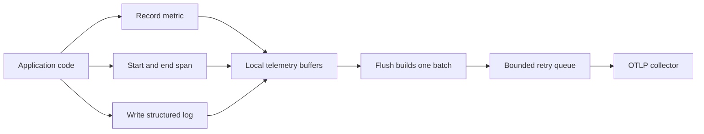
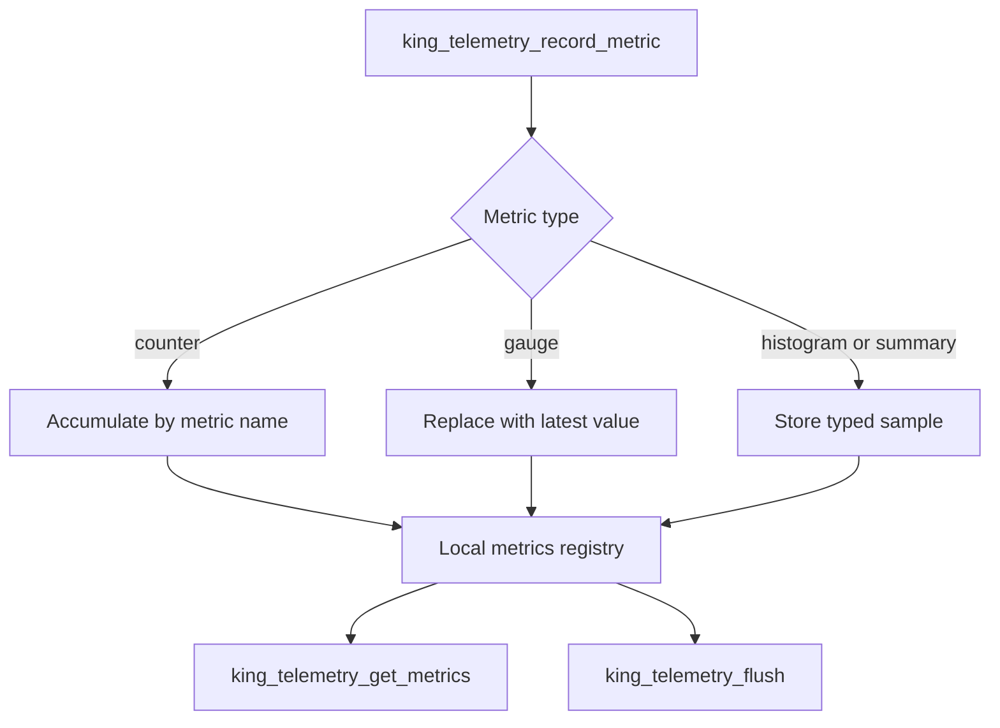
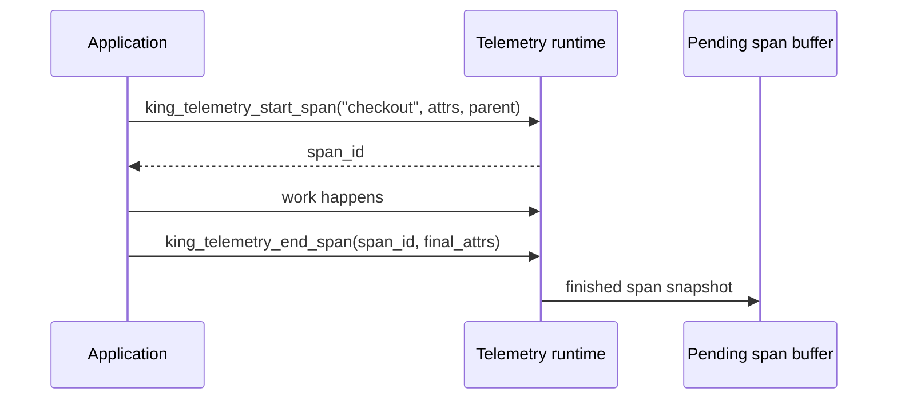
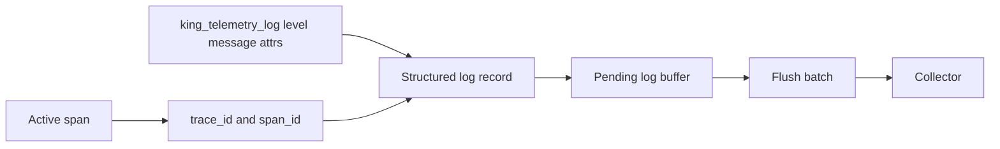
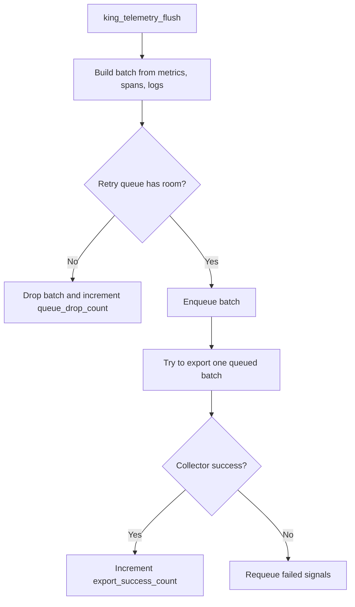
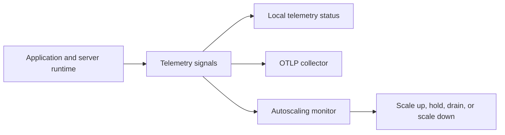

# Telemetry

Telemetry is how King measures what the runtime is doing, keeps that
information in local memory, and sends it to an external observability system
when you decide to flush it.

If you are new to observability, it helps to start with the basic words. A
[metric](./glossary.md#metric) is a number such as request rate or memory
usage. A [span](./glossary.md#span) is one timed unit of work inside a
[trace](./glossary.md#trace). A [log record](./glossary.md#log-record) is one
structured event message. An [OTLP](./glossary.md#otlp)
[collector](./glossary.md#collector) is the system that receives exported
telemetry. A [batch](./glossary.md#batch) is one group of telemetry records
that travel together.

The reason this matters in King is simple. Telemetry is not an optional side
channel. It is tied to autoscaling, runtime inspection, server request
instrumentation, release gates, and failure diagnosis. If the platform cannot
measure itself clearly, every other control loop gets weaker.

## Start With The Three Signal Types

King works with three telemetry signal families: metrics, spans, and logs.

Metrics answer the question "what is happening over time?" They are good for
trends, thresholds, alerting, and controller logic. Spans answer the question
"what happened during this one operation?" They are good for following one
request, one transfer, or one pipeline step from start to finish. Logs answer
the question "what important event happened, and what details came with it?"
They are good for human-readable diagnostic context and change history.

You usually need all three. A rising latency metric can tell you that a problem
exists. A trace can tell you where time was spent. A log can tell you which
node, input, or state transition made the problem visible.



This is the shape of the runtime. Telemetry is first recorded locally, then
grouped into export batches, then delivered to a collector through a bounded
queue.

## The King Telemetry Model

King keeps telemetry process-local. That means metrics, pending spans, pending
logs, and retry batches all live in the memory of the current PHP process. This
is a deliberate design choice because it keeps the runtime predictable and keeps
the write path fast.

The telemetry component exposes this contract directly through system
introspection. The component reports a delivery contract of
`best_effort_bounded_retry`, a queue persistence model of
`process_local_non_persistent`, a restart replay mode of `not_supported`, and a
drain behavior of `single_batch_per_flush`.

Those phrases are worth translating into plain English.

Best effort means the runtime will try to export data, but it does not promise
that every record will survive every outage. Bounded retry means failed export
batches stay queued for retry, but only until the configured queue limit is
reached. The same configured limit also bounds the pre-flush pending span and
pending log buffers, so capture stays finite even before a flush happens. That
same queue-derived limit now also caps how many distinct metric names may sit
live in the in-process registry before a flush, which keeps flush-side copy and
encoding cost from exploding under high-cardinality input. The active runtime
now also derives a fixed byte budget from that queue limit. Each queue slot
carries a `64 KiB` memory budget, and pending plus queued telemetry must stay
inside that combined byte ceiling.
Process-local non-persistent means telemetry is not written to durable storage
and does not survive process restart. Single batch per flush means one call to
`king_telemetry_flush()` gives the runtime one export opportunity for the next
queued batch rather than draining the whole queue in one call.

One subtle boundary matters here. Queued export batches stay process-local
until they succeed, fail repeatedly, or the process exits. But the unfinished
scratch state for the currently active span and the pre-flush pending span/log
buffers is not allowed to bleed into the next request or worker unit. If code
opens a span or records logs and then leaves that local work unfinished, King
drops that scratch residue at the next real request or worker execution
boundary unless the caller flushed it first.

This model is important because it tells you what telemetry is for. It is for
fast local instrumentation with controlled export behavior. It is not a durable
message broker.

## Metrics In Plain Language

Metrics are the simplest telemetry signal to understand because they are named
numeric values with optional [labels](./glossary.md#label). In King,
metrics are kept in a local registry keyed by metric name.

That registry behaves differently depending on metric type. A `counter` grows
by accumulation. If you record the same counter name repeatedly, King adds the
new value onto the old value. A `gauge` represents the latest observed value,
so recording a new gauge value replaces the previous value for that name.
`histogram` and `summary` samples are also recorded by metric name and exported
as typed metric data so the collector can interpret the stream correctly.
If you omit the metric type, King keeps the current runtime default and treats
the metric as a `counter`.

The registry stays live until flush. Repeated request or worker churn does not
silently smear flushed metric values into the next unit: once a unit flushes,
the next unit starts from an empty live metric registry again.

The registry is also bounded. King lets existing metric names keep updating, but
once the live registry has reached the queue-derived entry limit it stops
accepting brand-new metric names until a later flush clears the registry again.
That keeps flush CPU work tied to a configured ceiling instead of to accidental
or hostile cardinality spikes.

This makes counters useful for totals such as `requests_total`, while gauges
fit things like CPU utilization, queue depth, or active connections.



Metrics are also where telemetry meets control-plane logic most directly. The
autoscaling runtime reads live telemetry-backed values such as CPU utilization,
queue depth, request rate, response time, active connections, and memory
pressure. In other words, telemetry is one of the live inputs that turns
observability into action.

## Spans And Traces

A span is one timed operation. When you call `king_telemetry_start_span()`, you
open a new local unit of work and receive a span identifier. When you call
`king_telemetry_end_span()`, King closes that unit of work, merges any final
attributes you provide, and moves the finished span into the pending export
buffer.

The point of a span is not only timing. A span carries an operation name, a
trace identifier, a span identifier, an optional parent span identifier, start
and end times, and [attributes](./glossary.md#attribute) that describe the work
being done.

Attributes are simple key-value facts such as the target service, the request
path, the object identifier, or the status of the operation. They are how a
span turns from "something happened" into "this exact kind of work happened
with these important facts attached."



King also correlates logs with the active span. When a log is written while a
span is open, the log record inherits the current trace and span identifiers.
That matters because it keeps the human-readable event stream attached to the
operation that produced it.

That correlation is local to the current work unit. If a request or worker
leaves a span open and then returns control without flushing or ending it, King
clears that stale span before the next request or worker execution begins. The
next work unit does not inherit an old trace by accident.

## Logs

Logs in King are structured telemetry records, not plain text lines. A log has
a level, a message, a timestamp, and optional attributes. When a span is
active, the log also carries trace and span identifiers so the log can be tied
back to the operation that produced it.

This is useful because logs answer a different question from metrics or traces.
They capture the event that a human often wants to read directly. A warning
that inventory is low, a note that a node was drained, or a message that a peer
timed out are all easier to understand as logs than as metrics.

The log API does not force you to choose between readable text and machine
usable context. The message stays readable, while the attributes keep the
structured data attached.

Fresh logs stay in the pending log buffer until flush moves them into an export
batch. Repeated request or worker churn does not silently smear flushed log
records into the next unit: once a unit flushes, the next unit starts from an
empty pending log buffer again.



## What Flush Really Does

The most important telemetry function to understand operationally is
`king_telemetry_flush()`.

Flush does not mean "write everything durably right now." It means "take
whatever is currently sitting in the live metric registry and pending signal
buffers, put that material into an export batch, place that batch onto the
bounded retry queue, and then give the export path one chance to send the next
queued batch."

This detail matters because it explains why the queue exists and why the system
component reports `single_batch_per_flush`. A flush call has two jobs. First it
captures new local data into a batch. Second it advances the export queue by at
most one delivery attempt.

If the exporter succeeds, the batch is freed and the success counter grows. If
the exporter fails, only the signals that still failed remain in the batch, and
that batch is requeued for another attempt later. If the retry queue is already
full, the runtime drops the new batch and increments `queue_drop_count`. If the
pending span or pending log buffer is already at its capture ceiling before
flush, the runtime drops the new signal immediately and increments
`pending_drop_count`.



This is the core reliability story of the telemetry runtime. The queue is not
infinite. The retry path is explicit. Drops are counted. Restart replay is not
part of the contract.

## What Happens During Export Failure

A telemetry system is not defined only by success. It is defined by what it
does when the collector is slow, unreachable, or returning errors.

King handles failure by keeping the undelivered batch in the local retry queue
until a later flush cycle can try again. This gives short outages a clean
recovery path. At the same time, the queue has a fixed ceiling so exporter
failure cannot grow memory without limit. When that ceiling is hit, the runtime
starts dropping newly created batches and records that fact in
`queue_drop_count`.

One exporter-side boundary is intentionally fail-closed before any wire I/O
happens. King caps one OTLP request body at `1 MiB`. If the encoded JSON for a
metrics, spans, or logs export would exceed that size, King does not send a
partial request and does not poison the retry queue with a batch that can never
fit. The oversized signal is counted as an export failure for that flush and is
dropped locally so later healthy smaller exports can still proceed.

The collector reply path is bounded too. King also caps one OTLP response body
at `1 MiB`. If a collector replies with a larger body, the exporter aborts that
response, counts the flush as an export failure, and keeps the affected
metrics, spans, or logs batch retryable in the local queue. In other words:
oversized requests are dropped before dispatch because they can never succeed,
while oversized collector responses are treated as retryable exporter failures
because the same batch may still succeed against a healthy collector later.

There is one more terminal branch on the exporter boundary. If libcurl reports
that the configured collector host or proxy cannot be resolved, or that the
endpoint URL itself is not usable, King treats that as a permanent endpoint
failure for the current process configuration. The affected metrics, spans, or
logs batch is counted as an export failure and dropped locally instead of being
requeued forever behind an endpoint that this process cannot reach. That keeps
later healthy exports from being poisoned by a clearly non-retryable endpoint
mistake.

This behavior is usually the right tradeoff for a runtime library. It protects
the main application from turning telemetry failure into uncontrolled memory
growth, while still making the delivery problem visible through status counters.

## Telemetry And The Collector

King exports telemetry to an OTLP collector endpoint. In practical terms, that
means you point the runtime at a collector URL, choose the protocol family, and
let King send metric, trace, and log batches to the collector paths for those
signal types.

The main configuration values are the service name, exporter endpoint, exporter
protocol, exporter timeout, queue size, flush delay policy, metrics export
interval, histogram boundaries, trace sampler settings, and log batch sizing.

The collector is the boundary between the application runtime and the rest of
your monitoring system. Once the collector has the data, downstream systems can
store it, index it, graph it, alert on it, or correlate it with telemetry from
other services.

## Telemetry And Autoscaling

Telemetry and autoscaling are tightly connected in King. The autoscaling loop
does not operate only on static configuration. It consumes live signals from
telemetry and from system runtime state.

That means a metric such as `autoscaling.cpu_utilization` or
`autoscaling.queue_depth` is more than a graphing value. It can become a direct
control input. The monitoring loop can use these values to decide whether the
system should scale up, hold steady, drain, or scale down.

This is why telemetry belongs in the core handbook rather than being treated as
an optional integration feature. The platform uses it to decide what to do
next.



## Telemetry In The Server Runtime

The generic telemetry chapter is about the process-wide telemetry runtime, but
King also exposes a server-side telemetry snapshot on open listener-owned
sessions through `king_server_init_telemetry()`.

That server API belongs to the server runtime chapter because it attaches
telemetry state to one accepted session. Even so, it matters here because it
shows how telemetry travels into request handling. A server request can carry a
telemetry snapshot that tells you whether telemetry is enabled, which service
name is active, which exporter endpoint is configured, and whether metrics and
logs are enabled for that session-owned view.

That snapshot can now also expose `incoming_trace_context` when the accepted
request carried a valid `traceparent` header and an optional `tracestate`
header. King normalizes the inbound trace id, parent span id, and trace flags
into lowercase metadata on the request snapshot so the handler can inspect the
remote trace identity honestly. The runtime still does not synthesize an
already-active span before user code runs, but once the handler opens its
first request-root span that span now inherits the inbound trace id, remote
parent span id, trace flags, and optional trace state instead of silently
forking a fresh local root.

If you want the full server-side story, read
[Server Runtime](./server-runtime.md). If you want the process-wide telemetry
model, stay in this chapter.

## Trace Context At Boundaries

Distributed systems often need to move trace identity across request
boundaries. That is the job of [trace context](./glossary.md#trace-context) and
[propagation](./glossary.md#propagation).

King exposes three helpers for this boundary work.

`king_telemetry_get_trace_context()` now returns the live local span snapshot
for the current runtime when a span is active. Nested spans stay on the same
trace, the current child becomes the visible snapshot while it is active, and
closing that child restores the parent snapshot instead of dropping the trace
state entirely. `king_telemetry_inject_context()` now materializes the live
current span into an outgoing header array by adding lowercase `traceparent`
and optional `tracestate` fields when the caller did not already provide an
explicit boundary. If the caller already supplied `traceparent` or
`tracestate`, King preserves that explicit boundary untouched instead of
partially merging runtime state into it. `king_telemetry_extract_context()`
still returns `false` until the separate userland extraction leaf is
finalized. Incoming HTTP server requests are now separate from that userland
helper: their request telemetry snapshot can expose normalized inbound trace
metadata under `incoming_trace_context`, and the first request-root span
opened inside that handler now adopts that remote parent context while later
child spans stay on the same inherited trace. The inbound parent seed is then
cleared again before the next request starts so the propagation boundary stays
request-local.

The HTTP client transports use the same outgoing injection path automatically.
When a live span is active, `king_http1_request_send()`,
`king_http2_request_send()`, `king_http3_request_send()`, and the matching
dispatcher-backed client calls all emit the same `traceparent` and optional
`tracestate` headers unless the caller already pinned an explicit boundary in
the request headers.

The pipeline orchestrator now uses the same propagation model when
`orchestrator_enable_distributed_tracing` is enabled. A live controller span is
captured as a distributed parent snapshot when work is persisted, and a later
`king_pipeline_orchestrator_resume_run()` or
`king_pipeline_orchestrator_worker_run_next()` reopens that lineage through an
internal `pipeline-orchestrator-boundary` span. That keeps resumed work on the
original trace across process restarts and file-worker handoff instead of
quietly starting a fresh local root in the recovery process.

Even if you only use the basic span API at first, it is worth understanding
these helpers because they are the bridge between local tracing and
cross-service tracing.

## Configuring Telemetry

King exposes telemetry configuration in two layers. System INI sets the durable
deployment policy. Runtime configuration lets application code initialize the
active telemetry runtime from an inline array when policy allows it.

The most important settings are easy to describe in plain language.

`enable` turns telemetry on or off. `service_name` tells the collector which
service is sending the data. `exporter_endpoint` tells the runtime where the
collector lives. `exporter_protocol` selects the OTLP protocol family.
`exporter_timeout_ms` sets the maximum time one export attempt may take.
`batch_processor_max_queue_size` sets the size of the retry queue and the live
telemetry bounds derived from it.
`batch_processor_schedule_delay_ms` sets the intended delay policy for the
batch processor. `metrics_enable` and `logs_enable` let you control signal
families individually. `metrics_export_interval_ms` defines the metrics export
cadence. `metrics_default_histogram_boundaries` defines histogram bucket edges.
`traces_sampler_type` and `traces_sampler_ratio` control trace sampling.
`traces_max_attributes_per_span` limits attribute growth on one span.
`logs_exporter_batch_size` shapes log exporter batching.

Sampling semantics are now explicit instead of implied. `always_on` records new
local root spans and exports them normally. `always_off` still gives you a live
trace context and outgoing `traceparent` propagation with an unsampled `00`
flag, but closed spans never enter the pending export buffer. The default
`parent_based_probability` mode preserves the sampled or unsampled decision of
an active local or incoming remote parent, and only falls back to the
configured ratio when a brand-new local root has no parent context to inherit.

The following runtime example shows the usual shape.

```php
<?php

king_telemetry_init([
    'enabled' => true,
    'service_name' => 'checkout-api',
    'otel_exporter_endpoint' => 'http://127.0.0.1:4318',
    'otel_exporter_protocol' => 'http/protobuf',
    'batch_processor_max_queue_size' => 1024,
    'exporter_timeout_ms' => 5000,
]);
```

The same policy can be expressed at the system INI layer.

```ini
king.otel_enable=1
king.otel_service_name=checkout-api
king.otel_exporter_endpoint=http://127.0.0.1:4318
king.otel_exporter_protocol=http/protobuf
king.otel_exporter_timeout_ms=5000
king.otel_batch_processor_max_queue_size=1024
king.otel_metrics_enable=1
king.otel_logs_enable=1
```

The full key list is covered in
[Runtime Configuration](./runtime-configuration.md) and
[System INI Reference](./system-ini-reference.md).

## Reading Status And Local Snapshots

King gives you two fast local read paths for telemetry state.

`king_telemetry_get_status()` tells you whether the runtime is initialized and
how the delivery path is behaving. This status array includes the flush count,
the number of active metrics still in the live registry, the live
`metric_registry_limit`, cumulative `metric_drop_count`, the
`metric_registry_high_watermark`, the current retry queue size, the export
success count, the export failure count, the queue drop count, the pending
capture limit, the current pending span and log counts, and the pending drop
count. It also exposes the telemetry self-metrics for backlog pressure and
runtime cost: current `queue_bytes`, `pending_bytes`, and total
`memory_bytes`, the derived `memory_byte_limit`, queue and memory high-water
marks, `last_flush_cpu_ns`, `flush_cpu_high_water_ns`, and the
`retry_requeue_count` that shows how often failed batches were put back under
collector slowdown or outage.

`king_telemetry_get_metrics()` returns the current live metric registry before
those metrics are moved into a flush batch. This is useful when you want to
inspect local metrics in-process or feed them into another local control path.
The returned array is keyed by metric name, and a successful flush clears that
live registry back to empty.

These two calls are not duplicates. Status tells you how the runtime is doing.
Metrics tell you what signal data is currently sitting in the registry.

## Public API

This chapter covers the full public telemetry surface.

`king_telemetry_init()` initializes the active telemetry runtime from a config
array. Use it at process startup or at the beginning of a controlled
application lifecycle.

`king_telemetry_start_span()` opens a new local span and returns the active span
identifier. Use it at the start of a meaningful operation. Child spans stay on
the current trace and temporarily become the visible active context until they
close.

`king_telemetry_end_span()` closes an existing span and optionally merges final
attributes before the finished span moves into the pending export buffer. When a
child span closes, its parent becomes the active context again.

`king_telemetry_record_metric()` records one metric datapoint under a metric
name, with an optional label set and metric type. Omitting the type uses the
runtime default `counter` behavior.

`king_telemetry_log()` records one structured log event with a level, message,
and optional attributes. The fresh record stays in the pending log buffer until
flush captures it into an export batch.

`king_telemetry_flush()` captures the current local signals into a batch and
advances the bounded export queue by one delivery attempt. It is a bounded
drain opportunity, not an unbounded exporter loop.

`king_telemetry_get_status()` returns the current runtime counters and queue
state for the telemetry subsystem.

`king_telemetry_get_metrics()` returns the current live metrics registry keyed
by metric name until the next successful flush capture clears it.

`king_telemetry_get_trace_context()` returns the current live trace context
snapshot for code that needs explicit access to boundary metadata.

`king_telemetry_inject_context()` returns a header array containing the live
current span as `traceparent` plus optional `tracestate`, unless the caller
already supplied those headers explicitly. That propagation path also preserves
the current span's sampled bit, so unsampled traces continue downstream as
`traceparent` with `00` instead of being silently rewritten into sampled
traffic.

`king_telemetry_extract_context()` currently returns `false` until the incoming
propagation contract is finalized.

## Common Questions

One common question is whether telemetry survives restart. The answer is no.
Telemetry is process-local and non-persistent. If you need durable replay, that
belongs outside this runtime in the collector or in another queueing system.

Another common question is whether exporter failure blocks the application. The
runtime is designed so that it does not need an infinite or durable queue to
remain safe. Exporter failures raise failure counters, leave failed batches in a
bounded local retry queue, and eventually drop new batches when the queue cap is
reached. The pending pre-flush span and log buffers are bounded too, so a long
period without flush does not turn telemetry capture into unbounded memory
growth.

A third common question is how often to flush. The answer depends on your
runtime shape. A request-driven application often flushes at meaningful request
or job boundaries. A long-running worker may flush on an interval or after a
unit of work completes. The important point is that flush is the boundary where
local telemetry becomes exportable telemetry.

## Related Chapters

If you want to see how telemetry drives scaling decisions, read
[Autoscaling](./autoscaling.md). If you want to see how telemetry is attached to
accepted sessions and request handling, read [Server Runtime](./server-runtime.md).
If you want the system-wide component contract, read
[Platform Model](./platform-model.md). If you want the full configuration key
references, read [Runtime Configuration](./runtime-configuration.md) and
[System INI Reference](./system-ini-reference.md).
