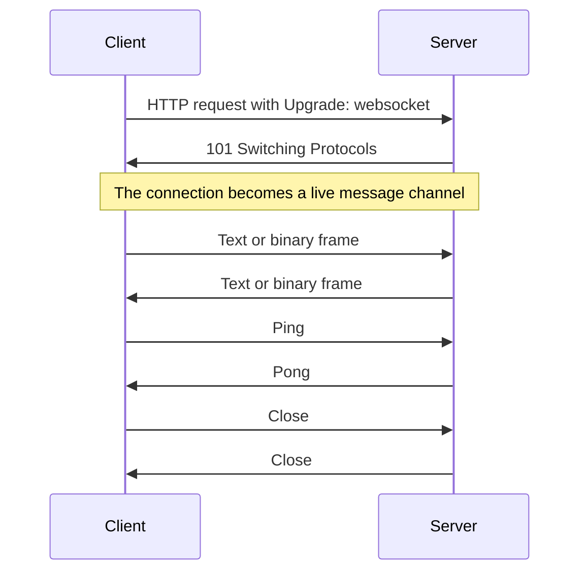
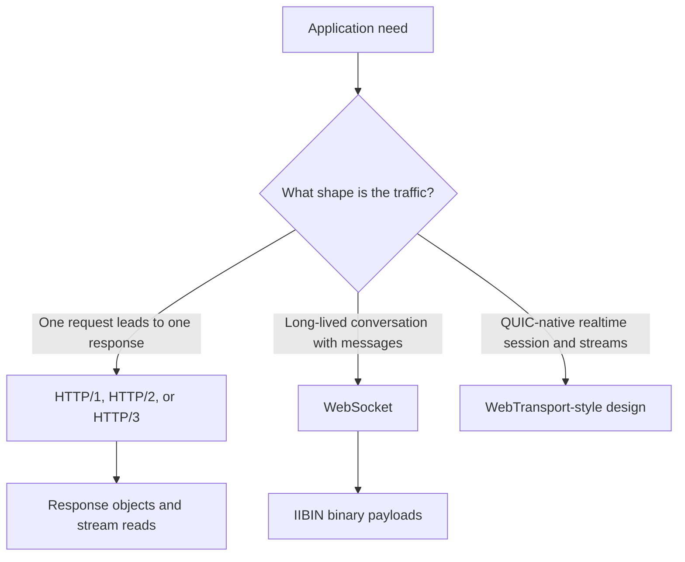
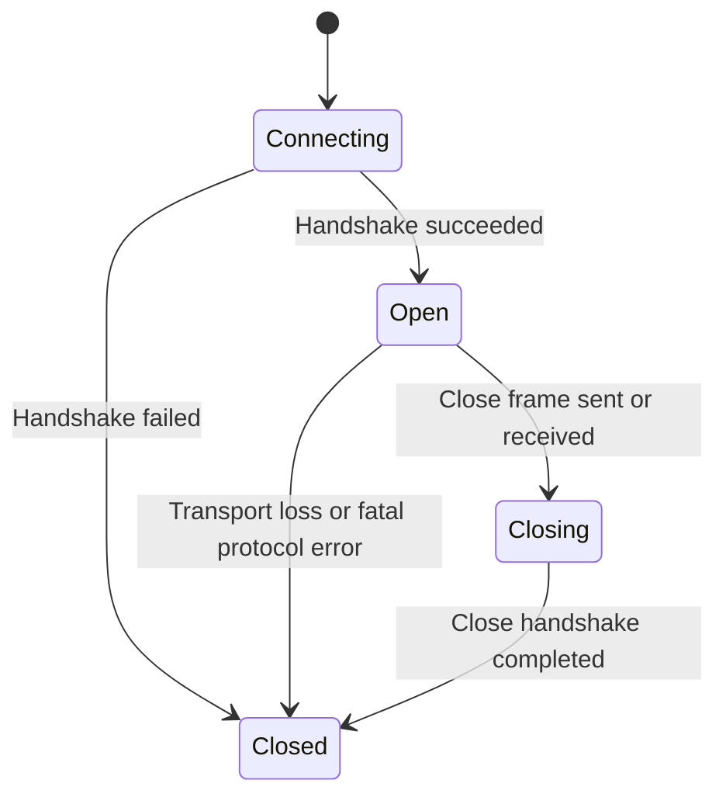
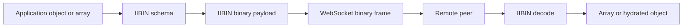

# WebSocket

WebSocket is the part of King you use when two sides need to keep a connection
open and exchange messages in both directions over time. If ordinary HTTP feels
like filling out a form and waiting for one answer, WebSocket feels like
opening a conversation and keeping the line open.

That idea sounds simple, but it changes the whole shape of an application. Once
the connection stays open, the system can push updates immediately, avoid
repeating the full request setup for every tiny message, and carry one
continuous flow instead of rebuilding a new request for every event.

This chapter explains what WebSocket is, why it exists, how it relates to HTTP,
QUIC, and HTTP/3, how King exposes it, why IIBIN and WebSocket work so well
together, and what operators need to think about when the channel is supposed
to stay healthy for a long time.

## Start With The Mental Picture

A WebSocket connection begins as an HTTP request. The client asks the server to
upgrade the HTTP conversation into a bidirectional channel. If the server
accepts, the two sides stop thinking in terms of "one request, one response"
and start thinking in terms of "one long-lived channel carrying many messages".

Those messages move as [frames](./glossary.md#frame). Some frames carry text.
Some frames carry binary payloads. Some frames are control frames, such as
ping, pong, or close. Control frames are small protocol signals rather than
general data carriers, so King treats oversized control-frame payloads as a
protocol violation and closes the connection instead of reading or allocating
them.



If you are new to WebSocket, this sequence is the whole shape of the protocol.
The rest of the chapter looks at each stage in more detail.

## Why Teams Use WebSocket

WebSocket is useful when the traffic is naturally a conversation. Dashboards,
chat systems, editors, trading views, notification channels, device fleets,
live control planes, and streaming user interfaces all fit this shape. The
system wants to keep one path open and move many messages through it over time.

A team can simulate some of this with repeated HTTP requests or long polling.
That works, but it keeps paying the cost of building a request, sending
headers, waiting, and tearing the exchange back down. Once the system is really
a long-lived conversation, WebSocket is the cleaner tool.

The protocol is also message-oriented, which matters more than many readers
first realize. A message-oriented protocol preserves boundaries between
messages. A raw byte stream does not. That is one reason realtime application
protocols often feel simpler over WebSocket than over an ordinary socket with a
homemade framing layer.

## Where WebSocket Sits In King

King is a full native runtime, and the WebSocket subsystem is only one part of
it. The same process can use HTTP clients, HTTP/3, QUIC, server listeners,
IIBIN, object storage, telemetry, orchestration, and WebSocket channels at the
same time.

That matters because a live channel rarely exists by itself. A frontend gateway
may accept a WebSocket from a browser, fetch state over HTTP/3, store durable
artifacts in the object store, encode updates with IIBIN, and emit telemetry
about connection churn. The benefit of King is that these pieces share one
runtime and one vocabulary instead of forcing the application to glue together
unrelated stacks.

## WebSocket, HTTP, QUIC, HTTP/3, And WebTransport

These names are often mentioned together, so it is worth separating them
cleanly.

WebSocket is a bidirectional message protocol that usually begins with an HTTP
upgrade. HTTP/3 is the HTTP layer over QUIC. QUIC is the transport explained in
[QUIC and TLS](./quic-and-tls.md). WebTransport is a different realtime model
that thinks more directly in QUIC sessions, streams, and datagrams.

The easiest way to choose between them is to ask what the traffic looks like.
If the traffic is still mostly requests and responses, ordinary HTTP is usually
the right tool. If the traffic is a long-lived message exchange, WebSocket is a
strong fit. If the design wants QUIC-native realtime streams or datagrams as
the main abstraction, you start thinking in WebTransport-like terms instead.



King keeps these ideas in one platform because production systems often need
more than one of them at the same time.

## The Two Public WebSocket Styles

King exposes WebSocket in a low-level procedural style and in an
object-oriented style.

The procedural API is the full control surface. It includes
`king_client_websocket_connect()`, `king_client_websocket_send()`,
`king_client_websocket_receive()`, `king_client_websocket_ping()`,
`king_client_websocket_get_status()`, `king_client_websocket_close()`,
`king_websocket_send()`, and `king_client_websocket_get_last_error()`.

The object-oriented API is `King\WebSocket\Connection`. Its methods are
`__construct()`, `send()`, `sendBinary()`, `ping()`, `close()`, and `getInfo()`.

The procedural API is the better choice when the code wants to control every
step explicitly, especially reads and last-error handling. The object-oriented
API is more comfortable when the code wants a clean connection object for the
common open, send, ping, close, and inspect operations.

## Opening A Connection

A connection usually starts with a URL, optional headers, and a few transport
options.

```php
<?php

$ws = new King\WebSocket\Connection(
    'wss://example.com/realtime',
    ['x-client-id' => 'demo'],
    [
        'handshake_timeout_ms' => 5000,
        'ping_interval_ms' => 25000,
        'max_payload_size' => 16 * 1024 * 1024,
        'max_queued_messages' => 64,
        'max_queued_bytes' => 64 * 1024 * 1024,
    ]
);
```

This constructor does more than store a URL for later. It performs the
handshake and creates a live connection. If the upgrade fails, the error
belongs to the connection step, not to some later first message.

The procedural equivalent is `king_client_websocket_connect()`. It returns a
handle that the rest of the procedural calls operate on.

## Connection Lifecycle

A WebSocket channel moves through a clear lifecycle. It starts in the connect
phase, enters the open phase when the handshake succeeds, may pass through a
closing phase when one side begins a close handshake, and eventually reaches a
closed state.



This lifecycle explains why the API has distinct operations for open, send,
receive, ping, status, and close. They are not arbitrary methods. They are the
real stages a live channel goes through.

## Sending Messages

WebSocket traffic is either text or binary. Text usually works well when the
payload is naturally human-readable, such as JSON or line-oriented text.
Binary usually works well when the payload is compact, schema-defined,
compressed, or otherwise not meant to be treated as text.

With the object-oriented API, `send()` transmits text and `sendBinary()`
transmits binary data.

```php
<?php

$ws->send('{"type":"hello","user":"ada"}');
$ws->sendBinary(random_bytes(32));
```

With the procedural API, `king_client_websocket_send($handle, $data, false)`
sends text and `king_client_websocket_send($handle, $data, true)` sends binary.
`king_websocket_send()` is an alias over the same runtime.

The type matters because it is part of the protocol contract between the two
sides. A text channel and a binary channel are often two different application
designs.

## Receiving Messages

The receive side of the procedural API is `king_client_websocket_receive()`.
The call waits for the next message and can use a timeout in milliseconds. If
it fails, `king_client_websocket_get_last_error()` returns the last recorded
error string for that connection.

```php
<?php

$handle = king_client_websocket_connect(
    'wss://example.com/realtime',
    ['x-client-id' => 'demo']
);

$payload = king_client_websocket_receive($handle, 1000);

if ($payload === false) {
    throw new RuntimeException(king_client_websocket_get_last_error());
}
```

This is a deliberate design choice. The receive API thinks in messages, not in
raw socket reads. The application does not have to rebuild message boundaries
from a byte stream.

## Ping, Pong, And Idle Health

A long-lived channel is only useful if both sides can notice when it has become
unhealthy. That is why the protocol includes ping and pong.

In King, `king_client_websocket_ping()` and `Connection::ping()` send a ping.
The peer answers with a pong. This is useful when the system wants to detect
dead peers more quickly, keep idle flows alive through network devices that do
not like silence, or measure basic path health without inventing an
application-level heartbeat message.

```php
<?php

$ws->ping('keepalive');
```

Heartbeats are not only a protocol detail. They shape how long the system takes
to notice a dead peer and how stable long-lived connections remain in real
network paths.

## Closing Cleanly

A WebSocket connection should normally end with an explicit close handshake
instead of an abrupt socket drop. That gives both sides a chance to agree that
the channel is done and to record a close code and reason.

```php
<?php

$ws->close(1000, 'normal shutdown');
```

The procedural equivalent is `king_client_websocket_close()`. The close code is
part of the contract. It tells the peer whether the channel ended normally,
because of a policy decision, because a payload was too large, because the
protocol was violated, or for some other defined reason.

## Status And Connection Metadata

The procedural `king_client_websocket_get_status()` returns the runtime status
code for the live connection. `Connection::getInfo()` returns a richer view of
the channel, including the connection identifier, remote address, negotiated
protocol information when available, handshake headers, and the current queued
message and byte counts plus the active queue limits.

You use status when the code wants a quick machine-readable state check. You
use `getInfo()` when the application needs a more descriptive picture for
diagnostics, logging, or routing decisions.

## Receive Backpressure And Queue Bounds

King now treats the receive side as a bounded queue instead of an unbounded
"keep reading until the process grows" path. The runtime can opportunistically
buffer multiple ready messages behind one `receive()` call, but it does so only
within explicit queue limits.

Two knobs shape that behavior:

- `max_queued_messages`
- `max_queued_bytes`

If a peer outruns the local consumer badly enough that the next frame would
overflow those bounds, King closes the channel with a policy close instead of
pretending that process memory is infinite. `Connection::getInfo()` exposes the
live queued counts and configured limits so the application can see whether a
connection is healthy, draining, or saturating.

Those same queue limits are part of the fairness story. A noisy or temporarily
stalled connection is supposed to burn through its own queue budget, not steal
progress from unrelated websocket clients sharing the same process.

## Server-Side Upgrade

On the server side, WebSocket starts as an incoming HTTP request. The server
looks at the request, validates the upgrade, and turns that HTTP exchange into
a WebSocket session when the application accepts it.

This is worth understanding because server-side WebSocket is not a separate
protocol island. It is an HTTP listener deciding to change the mode of a
connection. That is why the detailed listener behavior lives next to the server
runtime in this handbook.

## WebSocket And IIBIN

This combination is one of the strongest patterns in the extension.

WebSocket gives you a durable bidirectional message channel. [IIBIN](./iibin.md)
gives you a compact, schema-defined binary payload format. Together they let
the application move messages that are both efficient on the wire and explicit
in meaning.

This is especially useful when the system has high message rates, strict schema
rules, or payloads that need to evolve over time without turning into a mess of
informal text conventions.



Here is a small example:

```php
<?php

king_proto_define_schema('ChatMessage', [
    'room' => ['type' => 'string', 'field_number' => 1],
    'user' => ['type' => 'string', 'field_number' => 2],
    'body' => ['type' => 'string', 'field_number' => 3],
]);

$payload = king_proto_encode('ChatMessage', [
    'room' => 'general',
    'user' => 'ada',
    'body' => 'hello',
]);

king_client_websocket_send($handle, $payload, true);
```

On the receiving side, the peer decodes the binary frame with
`king_proto_decode()` or `King\IIBIN::decode()`. The result can be a plain
array or a hydrated object.

## Error Handling

WebSocket failures in King use a dedicated exception family:
`King\WebSocketException`, `King\WebSocketConnectionException`,
`King\WebSocketProtocolException`, `King\WebSocketTimeoutException`, and
`King\WebSocketClosedException`.

These names matter because they tell the application what kind of failure it is
looking at. A connection failure is different from a protocol violation. A
timeout is different from a normal close. A closed peer is different from an
invalid handshake. The more a system depends on long-lived realtime channels,
the more important those distinctions become.

## Configuration That Shapes WebSocket Behavior

Most WebSocket readers do not need every configuration key on day one, but they
do need to know which families matter.

Runtime configuration usually starts with payload size, handshake timeout, and
ping interval. Deployment-level configuration mirrors the same concerns through
the `king.*` directives. In practice, the first keys readers care about are the
ones that cap payload size, decide how long the handshake may take, and define
how aggressively the runtime keeps idle channels alive.

The detailed names live in the runtime configuration and system INI references.
The important part of this chapter is the mental picture: payload size limits
protect memory, handshake timeouts protect startup behavior, and ping settings
shape idle-health behavior.

## Operational Questions That Matter

A good WebSocket system is not only a system that can send one message
correctly. It is a system that behaves well when many channels stay open for a
long time.

The first operational question is how long a connection may stay idle before
the system treats it as stale. The second is how large a message may be before
the system rejects it. The third is how the application handles reconnects and
replay when the connection drops. The fourth is how heartbeats behave through
proxies, load balancers, mobile networks, and other noisy network paths.

King gives you the protocol tools, but the application still decides what
"healthy", "too large", "too idle", and "safe to replay" mean for its own
traffic.

## Common Mistakes

The first common mistake is treating WebSocket like request and response HTTP.
If the application tears the connection down after every small message, it is
paying the cost of a long-lived protocol without using its main advantage.

The second mistake is ignoring close semantics. A clean close carries useful
information and leaves both sides in a better state than an abrupt drop.

The third mistake is skipping heartbeats. Silent channels are harder to monitor
and recover, especially in real network paths that prune idle traffic.

The fourth mistake is sending large payloads without aligning size limits and
buffer expectations with what the application can actually handle.

## When To Choose WebSocket

Choose WebSocket when the application wants a familiar, widely understood,
message-based realtime channel. It is a strong choice for dashboards,
notifications, collaborative state, control channels, live feeds, and binary
message protocols that benefit from a stable connection.

If the traffic is still mostly request and response, use ordinary HTTP. If the
design wants QUIC-native streams or datagrams rather than framed messages,
think in WebTransport-style terms instead.

The important part is not to force every problem into one transport shape. King
supports multiple shapes because real systems need multiple shapes.

## Where To Go Next

If the binary payload story is what brought you here, read [IIBIN](./iibin.md)
next. If you want to understand the listener side of upgrades, continue with
[Server Runtime](./server-runtime.md). If you want the transport layer beneath
secure realtime channels, keep [QUIC and TLS](./quic-and-tls.md) open beside
this chapter.
